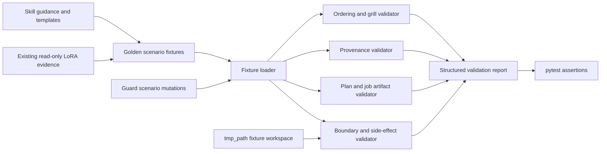

# Design Document: Phase 4 Planning-only Golden Path

## Overview

Phase 4 adds a deterministic, local validation layer for the existing documentation-driven research workflow. The implementation does not add an agent loop, experiment runner, network client, or execution abstraction. Instead, repository-local skill guidance and templates define expected behavior; human-readable scenario fixtures capture representative conversations and planning outputs; Python validators and pytest tests check the workflow contract.

The primary successful scenario is:

```text
LoRA rank-ablation request
  → repository-backed prior-research report
  → one-question-per-turn Research Grill
  → awaiting-approval plan.md
  → train.yaml and evaluate.yaml
  → concise approval summary
  → stop with no Run or execution
```

Focused guard scenarios mutate or replace parts of the successful scenario to prove that the suite detects multi-question turns, stable-setting re-asks, unsupported claims, unresolved scientific decisions, unresolved placeholders, forbidden commands, Run creation, and external-integration attempts.

Python is the implementation language because it is the dominant source language in the workspace and pytest/PyYAML are already used by repository validation tests.

## Design Goals

1. Make Phase 4 behavior reviewable as text and executable as deterministic tests.
2. Preserve discover → grill → plan responsibility boundaries.
3. Require provenance for prior-research and baseline claims.
4. Prove that user approval is the terminal Phase 4 boundary.
5. Keep all generated test artifacts inside pytest temporary directories or dedicated read-only fixture paths.
6. Reuse existing templates and example evidence without mutating existing experiments.

## Non-Goals

- Executing training or evaluation entrypoints.
- Initializing a Run or writing under a real `experiments/*/runs/` directory.
- Connecting to SSH or invoking Slurm.
- Querying live W&B data.
- Querying or uploading to Hugging Face Hub.
- Creating Git commits.
- Implementing a common Python research harness or an autonomous agent loop.
- Testing whether an external model follows prompts in real time.

## Evidence and Existing Conventions

The design is based on these repository sources:

- `.kiro/specs/ai-ml-research-template/spec.md`, Phase 4 and first-PR Golden Path.
- `AGENTS.md`, especially prior research, stable configuration, Phase 6/7/8 boundaries, and approval gates.
- `.agents/skills/discover-prior-research/` and `references/search-strategy.md`.
- `.agents/skills/grill-me/` and `references/grill-policy.md`.
- `.agents/skills/plan-ml-experiment/`, planning assets, schema, approval, resource, and example references.
- `templates/experiment-plan.md`, `templates/train-job.yaml`, and `templates/evaluate-job.yaml`.
- `experiments/example-lora-rank-ablation/`, including plan, jobs, journal, results, and commit `cb4d3df`.
- Existing pytest conventions in `tests/test_template_properties.py` and `tests/test_example_lora_integration.py`.
- Skill and planning-reference history in commits `cd6da83` and `f6f1aae`.

No populated root `project-plan.md` or `project-log.md` exists in the current workspace. The Golden Path therefore supplies populated project records only inside dedicated Scenario_Fixtures. The root files under `templates/` are examples and must not be reported as current project evidence.

## Architecture



### Layer 1: Normative workflow documents

The three existing skills remain the behavioral source of truth:

- `discover-prior-research` inventories and synthesizes evidence.
- `grill-me` asks one question per turn and resolves scientific decisions.
- `plan-ml-experiment` writes the plan/jobs and presents the approval summary.

Targeted edits align those documents with Phase 4 details already required by the roadmap:

- Explicit evidence references and missing-source handling in discovery.
- A machine-checkable one-question-per-assistant-turn rule and stable-setting exclusion in grill guidance.
- Agent-default front-loading, local-only destination labels, pre-approval validation, and terminal waiting behavior in planning guidance.

The implementation may align the root templates and the planning-skill assets where both represent the same artifact. Duplicate template sets remain compatible rather than silently diverging.

### Layer 2: Human-readable Scenario_Fixtures

Fixtures live under a dedicated path and are immutable test inputs:

```text
tests/fixtures/phase4-planning-golden-path/
├── golden/
│   ├── scenario.yaml
│   ├── transcript.yaml
│   ├── action-manifest.yaml
│   ├── source-workspace/
│   │   ├── project-plan.md
│   │   ├── project-log.md
│   │   └── experiments/prior-lora-rank-ablation/...
│   └── expected/
│       ├── discovery-report.yaml
│       ├── experiments/lora-rank-ablation/plan.md
│       ├── experiments/lora-rank-ablation/jobs/train.yaml
│       ├── experiments/lora-rank-ablation/jobs/evaluate.yaml
│       └── approval-summary.md
└── guards/
    ├── multiple-questions.yaml
    ├── stable-setting-reask.yaml
    ├── unsupported-evidence.yaml
    ├── incomplete-decisions.yaml
    ├── unresolved-placeholder.yaml
    ├── preapproval-execution.yaml
    ├── run-creation.yaml
    └── external-integration.yaml
```

The golden source workspace is synthetic and self-contained. It can reuse facts from the existing example, but references inside the fixture point either to fixture-local evidence or explicitly to the repository example/commit. The expected experiment remains `awaiting_approval`; no `runs/` content is included.

Guard fixtures use compact mutation descriptors instead of duplicating the full golden tree. Each guard identifies the base scenario, operation, target, replacement value, expected requirement identifier, and expected diagnostic code.

### Layer 3: Test-only Python validation library

A helper module under `tests/helpers/` validates fixture content. Keeping the validator under tests prevents the test oracle from becoming a production experiment harness.

Proposed files:

```text
tests/helpers/phase4_planning_validator.py
tests/test_phase4_planning_golden_path.py
tests/test_phase4_planning_guards.py
```

The helper module performs pure parsing and validation. The only file writes occur when tests copy a fixture source workspace into `tmp_path` and materialize expected generated outputs there.

### Layer 4: pytest suites

- Golden-path tests check the complete sequence and cross-artifact consistency.
- Guard tests parameterize all focused failure scenarios.
- Property tests generate controlled mutations for universal invariants.
- Preservation tests hash protected repository paths before and after validation.
- Static contract tests verify skill/template alignment and avoid adding an execution harness.

## Components and Interfaces

### 1. Fixture Loader

Responsibilities:

- Load YAML and Markdown fixtures using UTF-8.
- Resolve paths relative to the fixture root.
- Reject absolute paths and `..` traversal.
- Copy only `source-workspace/` into `tmp_path` when writable artifacts are needed.
- Normalize line endings and volatile fields before comparison.

Python interface:

```python
from dataclasses import dataclass
from pathlib import Path
from typing import Any, Mapping, Sequence

@dataclass(frozen=True)
class Scenario:
    scenario_id: str
    phase: int
    user_request: str
    stable_settings: Mapping[str, Any]
    decisions: Mapping[str, Any]
    transcript: Sequence["Turn"]
    evidence: Sequence["EvidenceRecord"]
    expected_artifacts: Mapping[str, Path]
    actions: Sequence["ObservedAction"]


def load_scenario(fixture_dir: Path) -> Scenario:
    """Load and validate a self-contained, traversal-safe scenario."""
```

### 2. Workflow State Validator

The validator models documentation events, not a live agent:

```text
REQUESTED
  → DISCOVERED
  → GRILLING
  → DECISIONS_RESOLVED
  → ARTIFACTS_VALIDATED
  → AWAITING_APPROVAL
```

`AWAITING_APPROVAL` is terminal in Phase 4. `APPROVED`, `RUN_CREATED`, `SUBMITTED`, `RUNNING`, and later states are invalid fixture events.

Validation checks:

- Discovery occurs before the first grill question.
- Every grill assistant turn contains exactly one semantic question.
- Every answer updates the matching decision before another question.
- Approval summary appears only after plan and job validation.
- The last assistant turn requests approval or modification and states that execution/Run creation has not occurred.

Question counting uses structured transcript fields (`kind: question`, `decision_key`) rather than punctuation alone. Rendered text is additionally checked to prevent a single structured question from containing multiple bundled prompts.

### 3. Stable Settings Validator

Stable setting keys are centralized:

```python
STABLE_SETTING_KEYS = frozenset({
    "environment.manager",
    "execution.default_target",
    "execution.ssh_host",
    "execution.remote_project_root",
    "execution.require_slurm_for_gpu",
    "execution.require_slurm_for_cpu_heavy",
    "slurm.partition",
    "slurm.account",
    "slurm.qos",
    "wandb.entity",
    "wandb.project",
    "wandb.mode",
    "huggingface.namespace",
    "huggingface.private",
    "huggingface.push_policy",
})
```

Each question has an explicit `decision_key`. A question targeting a populated stable key fails with `GRILL_STABLE_SETTING_REASK`. Missing fixture settings may be asked only when the setting is material to planning, and the fixture must record why no inherited value exists.

### 4. Evidence and Discovery Validator

Evidence records separate facts from conclusions:

```python
@dataclass(frozen=True)
class EvidenceRecord:
    evidence_id: str
    source_type: str
    source_ref: str
    claims: tuple[str, ...]
    content_digest: str | None = None
```

The validator checks that:

- `source_ref` resolves to a fixture/repository path or declared Git commit.
- Every discovery finding cites one or more evidence IDs.
- Applicable source types were inspected or explicitly recorded as absent.
- Baseline metrics match structured results when structured results exist.
- Narrative/structured conflicts appear in `conflicts`.
- Duplication classification matches fixture overlap facts.
- `templates/project-log.md` cannot satisfy a missing root `project-log.md` check.

Git evidence is fixture metadata (`commit`, `path`, `finding`) captured from known repository history. Tests do not invoke remote Git operations or mutate repository history.

### 5. Decision Ledger Validator

A decision ledger records origin and readiness:

```python
@dataclass(frozen=True)
class Decision:
    key: str
    value: Any
    origin: str  # user | project_setting | prior_evidence | agent_default
    rationale: str
    evidence_ids: tuple[str, ...]
    resolved: bool
```

Required approval decisions are `research_objective`, `baseline`, `primary_metric`, `success_criteria`, `ablation_scope`, and `controlled_parameters`. The first three scientific completeness fields—baseline, primary metric, success criteria—hard-block approval when unresolved.

Agent defaults require a rationale and either evidence IDs or the explicit marker `assumption: true`. Project settings cannot be mislabeled as defaults.

### 6. Experiment Plan Validator

The plan validator parses YAML frontmatter and Markdown headings. It checks:

- Schema version 1 and kebab-case ID.
- `status: awaiting_approval` and `approval.status: pending`.
- Null approval identity/timestamp/commit before approval.
- Primary metric name/direction and measurable success criteria.
- Exactly the expected train/evaluate job references for the Golden Path.
- No unresolved `<placeholder>`, bracket placeholder, or fixture sentinel.
- Agent-Determined Defaults appears before detailed Design and Risks sections.
- Required narrative sections and prior-evidence references exist.
- Baseline value, direction, split, and source are complete and align with discovery.

### 7. Job Configuration Validator

The job validator builds on current template tests and adds cross-file semantics:

- Required keys: `job_id`, `type`, `entrypoint`, `parameters`, `resources`.
- Training job has exactly the intended LoRA rank matrix and all controlled values.
- Evaluation metrics include the plan primary metric.
- Training and evaluation dataset identity/split choices align with the plan.
- W&B group equals the experiment ID in both jobs.
- SSH-targeted GPU work uses `backend: slurm` and carries a Phase 6 unavailable marker in planning metadata.
- W&B and HF fields are labeled planned/unverified with Phase 7/8 availability.
- Secret-like keys and values are rejected.
- Required placeholders are rejected.

A conservative secret detector checks key names such as `token`, `password`, `api_key`, `private_key`, and known credential prefixes. The detector reports the YAML path but redacts the value.

### 8. Approval Summary Validator

The Approval_Summary is parsed by ordered Markdown headings. The validator cross-checks all values against plan/job/discovery data rather than trusting duplicated text.

Required ordered content:

1. Recommended plan.
2. Agent-determined defaults.
3. Objective and hypothesis.
4. Baseline, primary metric, and success criterion.
5. Matrix, run count, resources, and risks.
6. Planned/unverified W&B and HF destinations.
7. Plan/job paths.
8. Explicit approve-or-modify request.
9. No-execution/no-Run declaration.

Resource estimates are treated as documented estimates. Tests check arithmetic consistency with matrix cardinality and requested time, not real cluster duration.

### 9. Boundary and Side-Effect Validator

Scenario actions are declared in `action-manifest.yaml` with action kind and target. Allowed actions are local reads plus writes under the Fixture_Workspace.

Forbidden classes include:

- Training/evaluation entrypoint invocation.
- Run initialization or any write under `runs/`.
- `ssh`, `scp`, or equivalent remote access.
- `sbatch`, `srun`, `squeue`, `scancel`, or equivalent Slurm operations.
- W&B API/CLI/client calls.
- Hugging Face API/CLI/client calls or uploads.
- `git commit`.

The validator also scans fenced and inline shell commands in transcripts and summaries. This catches a fixture that claims no execution while emitting an executable forbidden command.

Roadmap labels map operation families to later phases:

```python
EXTERNAL_PHASES = {
    "ssh": 6,
    "slurm": 6,
    "wandb": 7,
    "huggingface": 8,
}
```

### 10. Preservation Validator

Before a scenario test, the suite records SHA-256 digests for:

- `experiments/example-lora-rank-ablation/**`.
- Root project records when present.
- Any repository path declared protected by the scenario.

After validation, hashes and path inventories must match. Every observed test write must resolve under pytest `tmp_path`. Dedicated fixture files are read-only inputs; expected artifacts are copied before any mutation-based test.

## Data Models

### `scenario.yaml`

```yaml
schema_version: 1
scenario_id: lora-rank-ablation-golden
phase: 4
request: "Run a LoRA rank ablation"
source_workspace: source-workspace
transcript: transcript.yaml
action_manifest: action-manifest.yaml
expected:
  discovery_report: expected/discovery-report.yaml
  plan: expected/experiments/lora-rank-ablation/plan.md
  train_job: expected/experiments/lora-rank-ablation/jobs/train.yaml
  evaluate_job: expected/experiments/lora-rank-ablation/jobs/evaluate.yaml
  approval_summary: expected/approval-summary.md
protected_paths:
  - experiments/example-lora-rank-ablation
```

### `transcript.yaml`

```yaml
turns:
  - index: 0
    actor: user
    kind: request
    text: "Run a LoRA rank ablation"
  - index: 1
    actor: assistant
    kind: discovery
    artifact: expected/discovery-report.yaml
  - index: 2
    actor: assistant
    kind: question
    decision_key: primary_metric
    text: "Which metric should determine the best rank?"
  - index: 3
    actor: user
    kind: answer
    resolves: primary_metric
    value: accuracy
```

The final fixture includes one turn for each unresolved material decision. Stable Project_Settings appear in fixture project-plan data and never as `decision_key` values in questions.

### `discovery-report.yaml`

```yaml
inspected:
  - source_type: project_plan
    source_ref: project-plan.md
  - source_type: project_log
    source_ref: project-log.md
findings:
  - finding_id: prior-rank-result
    statement: "Prior rank-16 accuracy was 0.874"
    evidence_ids: [prior-results]
baselines:
  - metric: accuracy
    value: 0.874
    source_evidence_id: prior-results
duplication:
  level: near_duplicate
  differences: ["new multi-seed design"]
  recommendation: extend_existing
conflicts: []
missing_sources: []
```

### `action-manifest.yaml`

```yaml
actions:
  - kind: local_read
    target: project-plan.md
  - kind: local_write
    target: experiments/lora-rank-ablation/plan.md
terminal_state: awaiting_approval
run_artifacts_created: []
external_operations: []
git_commits_created: []
```

### Guard descriptor

```yaml
scenario_id: guard-multiple-questions
base: ../golden
mutation:
  operation: replace_turn_text
  target: transcript.turns[2].text
  value: "Which metric and baseline should we use?"
expected_failure:
  requirement: "3.1"
  code: GRILL_MULTIPLE_QUESTIONS
  location: transcript.turns[2]
```

## Validation Result and Diagnostics

```python
@dataclass(frozen=True)
class Diagnostic:
    scenario_id: str
    requirement: str
    code: str
    location: str
    message: str

@dataclass(frozen=True)
class ValidationResult:
    valid: bool
    diagnostics: tuple[Diagnostic, ...]
```

Diagnostics are sorted by `(requirement, code, location)` to remain deterministic. Messages contain no timestamps, absolute temporary paths, credentials, or platform-specific separators.

Representative codes:

- `FLOW_DISCOVERY_OUT_OF_ORDER`
- `GRILL_MULTIPLE_QUESTIONS`
- `GRILL_STABLE_SETTING_REASK`
- `EVIDENCE_UNSUPPORTED_CLAIM`
- `DECISION_REQUIRED_UNRESOLVED`
- `PLAN_PLACEHOLDER_UNRESOLVED`
- `JOB_SECRET_DETECTED`
- `BOUNDARY_EXECUTION_ATTEMPT`
- `BOUNDARY_RUN_CREATED`
- `BOUNDARY_EXTERNAL_OPERATION`
- `FIXTURE_WRITE_ESCAPED`
- `FIXTURE_NONDETERMINISTIC_DEPENDENCY`

## Error Handling

Validation accumulates independent diagnostics where safe, enabling one test run to show all fixture defects. Parsing or traversal errors stop validation for the affected artifact because downstream interpretation would be unreliable.

| Condition | Behavior |
|---|---|
| Invalid YAML/frontmatter | Report schema diagnostic with file and field; skip semantic checks for that document |
| Missing evidence file | Report missing-source diagnostic; reject dependent claim |
| Conflicting evidence | Require an explicit conflict record; reject silent preference |
| Missing critical decision | Keep logical state at `GRILLING`; reject approval summary |
| Unresolved placeholder | Reject artifact before approval transition |
| Secret-like value | Redact value; report YAML path; reject artifact |
| Forbidden command/action | Report requirement 8.x; reject scenario immediately as unsafe |
| Write outside fixture workspace | Report escaped path; stop the scenario test |
| Nondeterministic dependency | Reject fixture before evaluating expected outputs |

## Security and Data Preservation

- YAML uses `yaml.safe_load`.
- Fixture-relative paths are resolved and checked with `Path.is_relative_to` semantics.
- Tests never copy credentials and reject secret-like fixture values.
- No subprocess is needed for Golden Path validation.
- Existing example files are read and hashed only.
- Mutation tests operate on in-memory structures or copies under `tmp_path`.
- Approval status remains pending; fixtures contain no approval identity or timestamp.
- External destinations are descriptive metadata only.

## Testing Strategy

### Property-Based Testing Strategy

Hypothesis is already available in the workspace. Property tests use at least 100 examples per property and generate small structured mutations, not external calls. Every property test carries a tag in its docstring or test metadata:

```text
Feature: phase-4-planning-golden-path, Property N: <property title>
```

Example-based tests cover the canonical full transcript, exact required sections, and repository preservation. Property tests cover broad path, ordering, mutation, provenance, and rejection invariants.

### Unit and Scenario Test Strategy

#### Example and integration tests

- Load the full successful scenario and verify every expected event and artifact.
- Verify one train and one evaluate job are referenced.
- Verify exact plan sections and Approval_Summary sections.
- Verify every required guard fixture exists and fails for the expected rule.
- Verify skill descriptions preserve handoff boundaries.
- Verify no production runner/agent-loop module is added.
- Verify tasks.md leaf-task traceability during spec review or a lightweight spec test.
- Hash the real example LoRA directory before and after the suite.

#### Property tests

- Generate reordered event sequences.
- Generate populated stable keys and question targets.
- Generate findings with missing/invalid evidence links.
- Generate incomplete decision ledgers.
- Insert placeholders at arbitrary required fields.
- Generate matrix values and check resource/run-count arithmetic.
- Generate forbidden command variants and external-operation classes.
- Generate relative and escaping paths.
- Repeat normalized validation results.

#### Test command

```bash
pytest -q tests/test_phase4_planning_golden_path.py tests/test_phase4_planning_guards.py
```

The command performs local, bounded validation only. It must not start training, create real Runs, or contact external services.

## Correctness Properties

The prework classified every acceptance criterion. Property reflection consolidated overlapping state, provenance, and safety checks: pending-state, no-Run, no-external-call, and forbidden-command rules form one pre-approval safety invariant; plan/job completeness checks are grouped by artifact while retaining separate train/evaluate assertions; evidence inventory, provenance, conflict, and baseline support form one evidence-closure property. Static architecture and exact Golden Path examples remain example/integration tests rather than artificial properties.

### Property 1: Ordered planning state transitions

For any valid Planning_Session, the observed states shall follow request → discovery → grill → decisions resolved → artifacts validated → awaiting approval, and no later state shall appear in Phase 4.

**Validates: Requirements 1.1, 3.2, 3.5, 5.1, 7.1, 9.2**

### Property 2: Pre-approval safety invariant

For any Planning_Session without Explicit_Approval, experiment and approval states shall remain pending, no Run artifact or Git commit shall be created, no training or evaluation command shall execute, and no External_Integration operation shall occur.

**Validates: Requirements 1.2, 1.3, 1.4, 1.5, 8.1, 8.2, 8.3, 8.4, 8.5**

### Property 3: Evidence closure and baseline integrity

For any Discovery_Report, every reported finding and baseline value shall be derivable from cited inspected evidence, every available relevant evidence source shall be inspected or explicitly marked absent, structured/narrative conflicts shall be reported, and duplication classification shall match the declared overlap facts.

**Validates: Requirements 2.1, 2.2, 2.3, 2.4, 2.5, 2.6, 5.3, 5.4**

### Property 4: Focused, non-redundant grilling

For any Research_Grill transcript, each assistant question turn shall contain exactly one Material_Decision, populated Project_Settings shall not be questioned, insufficient answers shall receive one focused follow-up or labeled default, and evidence conflicts shall receive one focused disambiguation question.

**Validates: Requirements 3.1, 3.3, 3.4, 3.6**

### Property 5: Decision provenance and readiness

For any decision ledger, every required decision shall record a value and origin, each Agent_Default shall include rationale plus evidence or an explicit assumption, inherited settings shall remain distinguishable from defaults, and any unresolved baseline, primary metric, or success criterion shall block approval-summary generation.

**Validates: Requirements 4.1, 4.2, 4.4, 4.5**

### Property 6: Plan validity and review order

For any generated Experiment_Plan accepted for approval, frontmatter shall satisfy the plan schema, required narrative sections shall be present, Agent-Determined Defaults shall precede detailed design and risks, evidence references shall resolve, and no unresolved placeholder shall remain.

**Validates: Requirements 4.3, 5.1, 5.2, 5.3, 5.5**

### Property 7: Reproducible and phase-bounded jobs

For any accepted LoRA planning output, train and evaluate Job_Configurations shall satisfy their schemas and cross-file constraints; SSH-targeted GPU jobs shall declare Slurm with Phase 6 unavailability; W&B and Hugging Face metadata shall remain planned and unverified until Phases 7 and 8; and secrets, missing keys, or required placeholders shall cause rejection.

**Validates: Requirements 6.1, 6.2, 6.3, 6.4, 6.5, 6.6, 6.7**

### Property 8: Approval summary consistency

For any accepted planning artifact set, the Approval_Summary shall front-load the recommendation and Agent_Defaults, reproduce required scientific and resource values consistently, label external destinations planned/unverified, provide artifact paths, request approval or modification, and declare that execution and Run creation have not occurred.

**Validates: Requirements 7.2, 7.3, 7.4, 7.5**

### Property 9: Fixture write confinement and preservation

For any Scenario_Fixture validation, every write shall resolve beneath the Fixture_Workspace and every protected user-owned or example path shall retain the same path inventory and byte digest after validation.

**Validates: Requirements 9.4, 9.5, 10.5**

### Property 10: Deterministic validation

For any Scenario_Fixture without forbidden dependencies, repeated validation shall produce equivalent validity and normalized diagnostics; any dependency on wall-clock time, network state, credentials, or mutable external data shall be rejected before scenario evaluation.

**Validates: Requirements 9.1, 9.6, 9.7**

### Property 11: Guard diagnostic traceability

For any valid mutation that violates one declared Phase 4 rule, validation shall fail with a diagnostic containing the Scenario_Fixture identifier, violated requirement identifier, stable diagnostic code, and relevant artifact or transcript location.

**Validates: Requirements 9.3, 10.3**

## Requirement-to-Component Traceability

| Requirements | Primary components |
|---|---|
| 1.x | Workflow State Validator, Boundary Validator |
| 2.x | Evidence and Discovery Validator |
| 3.x | Workflow State Validator, Stable Settings Validator |
| 4.x | Decision Ledger Validator, Plan Validator |
| 5.x | Experiment Plan Validator |
| 6.x | Job Configuration Validator |
| 7.x | Approval Summary Validator |
| 8.x | Boundary and Side-Effect Validator |
| 9.x | Fixture Loader, Preservation Validator, pytest suites |
| 10.x | Static contract tests, diagnostics, repository preservation tests |

## Implementation Constraints

1. Do not add dependencies unless current pytest, PyYAML, and Hypothesis capabilities are insufficient.
2. Do not invoke subprocesses for scenario validation.
3. Do not write into `experiments/example-lora-rank-ablation/`.
4. Do not create `runs/` content anywhere except an intentionally invalid copy inside `tmp_path` for a guard test.
5. Do not contact any network endpoint.
6. Do not create a Git commit.
7. Keep all validators test-focused; existing Markdown/YAML skills remain the workflow implementation.
